<h2 align="left">Hi, I'm Antonin Do Souto</h2>

<h3 align="left">C/C++ Linux Engineer · Embedded Reliability & Failure Analysis · Technical Trainer</h3>

I investigate and stabilize Linux, C and C++ systems affected by crashes, freezes, watchdog resets, stale data, communication failures and unclear runtime behavior.

My focus is on understanding what a system is actually doing when it fails, making that behavior observable, and turning incomplete evidence into a structured technical investigation.

---

<h3 align="left">What I do</h3>

<ul>
  <li>
    <b>Embedded reliability:</b>
    fault handling, deterministic state machines, degraded modes, fail-safe behavior, watchdogs and observability
  </li>
  <li>
    <b>Linux & native debugging:</b>
    C/C++, runtime failures, memory issues, traces, core dumps and performance investigation
  </li>
  <li>
    <b>Technical rescue:</b>
    structured investigation of unstable, poorly understood or difficult-to-reproduce systems
  </li>
  <li>
    <b>Technical training:</b>
    C, C++, Linux, Git, Docker and practical debugging methodology
  </li>
</ul>

---

<h3 align="left">Technical focus</h3>

<ul>
  <li>C and C++ on Linux systems</li>
  <li>Embedded Linux diagnostics and runtime instability</li>
  <li>GDB, Valgrind, sanitizers, strace, ltrace and perf</li>
  <li>systemd, journald, watchdogs and core dumps</li>
  <li>State machines, fault handling and deterministic behavior</li>
  <li>Degraded modes, fail-safe logic and recovery behavior</li>
  <li>Communication failures, stale data and distributed system state</li>
  <li>Technical triage for crashes, freezes and unclear field failures</li>
</ul>

---

<h3 align="left">Selected systems work</h3>

<table>
  <tr>
    <td>
      <b>
        <a href="https://github.com/pop-os/launcher/pull/291">
          Pop!_OS COSMIC Launcher
        </a>
      </b>
    </td>
    <td>
      Rust and Wayland contribution adding Alt-Tab window thumbnails using asynchronous screencopy,
      SHM buffer processing, caching and integration into an existing open-source codebase.
    </td>
  </tr>

  <tr>
    <td>
      <b>
        <a href="https://github.com/PGADS-Dev/Sentinel-Dual-Control-System">
          Sentinel
        </a>
      </b>
    </td>
    <td>
      C-based embedded reliability demonstrator built around deterministic fault detection,
      explicit INIT / NOMINAL / DEGRADED / FAIL_SAFE states, reproducible tests and observable system behavior.
      Current work focuses on the portable behavioral core before STM32, CAN and Raspberry Pi integration.
    </td>
  </tr>

  <tr>
    <td>
      <b>
        <a href="https://github.com/avainfo/AegisEdge">
          Aegis Edge
        </a>
      </b>
    </td>
    <td>
      C++ resilient telemetry prototype handling delayed, stale and lost UDP data through explicit
      NORMAL / DEGRADED / LOST behavior and degraded-mode visualization.
    </td>
  </tr>

  <tr>
    <td>
      <b>
        <a href="https://github.com/PGADS-Dev/BlackBoxWhisperer">
          BlackBoxWhisperer
        </a>
      </b>
    </td>
    <td>
      Deterministic technical-analysis tooling designed to reconstruct and document behavior from
      unfamiliar codebases while producing reproducible analysis artifacts.
    </td>
  </tr>

  <tr>
    <td>
      <b>
        <a href="https://github.com/avainfo/linux_config">
          linux_config
        </a>
      </b>
    </td>
    <td>
      Reproducible Linux workstation setup for native C/C++ development, embedded Linux work,
      debugging and diagnostic workflows.
    </td>
  </tr>

  <tr>
    <td>
      <b>
        <a href="https://github.com/avainfo/cpp-linux-debugging-labs">
          C++ Linux Debugging Labs
        </a>
      </b>
    </td>
    <td>
      Hands-on failure investigation exercises covering Linux C++ crashes, memory leaks,
      use-after-free defects and diagnostic tooling.
    </td>
  </tr>
</table>

---

<h3 align="left">Embedded Failure Triage Sprint</h3>

I provide short, fixed-scope technical interventions for embedded and Linux teams dealing with
crashes, freezes, watchdog resets, unstable startup, communication failures or non-deterministic runtime behavior.

The objective is not to promise an instant root cause.
The objective is to reduce uncertainty quickly, separate facts from assumptions,
prioritize credible failure hypotheses, identify missing evidence and leave the team with a clear technical action plan.

<ul>
  <li><b>Light sprint:</b> 2 to 3 days</li>
  <li><b>Standard sprint:</b> 4 to 5 days</li>
  <li><b>Deliverables:</b> technical triage, prioritized hypotheses, evidence gaps, instrumentation recommendations and written next-step plan</li>
</ul>

---

<h3 align="left">Available for</h3>

<ul>
  <li>C/C++ Linux engineering</li>
  <li>Embedded reliability and fault-handling work</li>
  <li>Failure investigation and technical rescue</li>
  <li>Short fixed-scope diagnostic engagements</li>
  <li>Systems software and Embedded Linux consulting</li>
  <li>Technical training and developer coaching</li>
</ul>

Based in <b>Porto, Portugal</b> and available for remote B2B, contractor and consulting work across Europe
and with international teams.

Short on-site interventions are also possible when useful for hardware access, commissioning or failure reproduction.

---

<h3 align="left">Contact</h3>

  

  &nbsp;&nbsp;&nbsp;&nbsp;

  

  &nbsp;&nbsp;&nbsp;&nbsp;

  

 

  

---

<h3 align="left">Core stack</h3>

  
  

  
  

  
  

  
  

  
  

  

---

<h3 align="left">GitHub activity</h3>

  

  

 

  

 

