<h2 align="left">Hi, I'm Antonin Do Souto</h2>

<h3 align="left">C/C++ Linux Engineer · Systems Debugging · Embedded Reliability · Technical Trainer</h3>

 

  

  My focus is making failures observable, reducing uncertainty and turning incomplete evidence into a structured technical investigation.

  <b>6+ years in independent software development</b> ·
  <b>3+ years in technical training</b> ·
  Based in <b>Porto, Portugal</b>

---

<h3 align="left">What I work on</h3>

<ul>
  <li>
    <b>Linux & native debugging:</b>
    C/C++, crashes, memory issues, core dumps, traces, runtime failures and performance investigation
  </li>
  <li>
    <b>Failure handling & reliability:</b>
    deterministic state machines, fault handling, degraded modes, fail-safe behavior, watchdogs and recovery logic
  </li>
  <li>
    <b>Embedded & telemetry systems:</b>
    stale or lost data, communication failures, runtime instability, observability and system supervision
  </li>
  <li>
    <b>Technical rescue & training:</b>
    structured investigation, debugging methodology, C/C++, Linux, Git and Docker
  </li>
</ul>

---

<h3 align="left">Technical toolbox</h3>

  
  
  
  
  
  
  
  
  
  
  

 

  <code>GDB</code> ·
  <code>Valgrind</code> ·
  <code>ASan / UBSan</code> ·
  <code>strace</code> ·
  <code>ltrace</code> ·
  <code>perf</code> ·
  <code>systemd</code> ·
  <code>journald</code> ·
  <code>CMake</code>

---

<h3 align="left">Selected systems work</h3>

  <b>Systems work built around one principle:</b> 
  <i>failures should be observable, reproducible and explainable.</i>

 

<h3>
  🪟
  <a href="https://github.com/pop-os/launcher/pull/291">
    Pop!_OS COSMIC Launcher
  </a>
</h3>

  <code>Rust</code>
  <code>Wayland</code>
  <code>screencopy</code>
  <code>async</code>
  <code>open upstream PR</code>

<blockquote>
  

    Open upstream contribution adding Alt-Tab window thumbnails through asynchronous
    Wayland screencopy, SHM buffer processing, RGBA thumbnail generation,
    caching and refresh handling.
  

  

    <strong>Demonstrates:</strong>
    integration into an existing open-source systems codebase,
    asynchronous Rust, Wayland protocols and low-level image-buffer handling.
  

</blockquote>

 

<h3>
  📡
  <a href="https://github.com/avainfo/AegisEdge">
    Aegis Edge
  </a>
</h3>

  <code>C++</code>
  <code>UDP telemetry</code>
  <code>fault injection</code>
  <code>degraded modes</code>
  <code>working prototype</code>

<blockquote>
  

    Resilient telemetry system reacting explicitly to delayed, stale and lost data
    through <code>NORMAL</code>, <code>DEGRADED</code> and <code>LOST</code> states.
  

  

    A controllable chaos proxy injects latency, packet loss and complete
    communication cuts to demonstrate degradation and recovery.
  

  

    <strong>Demonstrates:</strong>
    explicit failure handling, telemetry supervision,
    reproducible fault injection and degraded-system behavior.
  

</blockquote>

 

<h3>
  🛡️
  <a href="https://github.com/PGADS-Dev/Sentinel-Dual-Control-System">
    Sentinel Dual-Control System
  </a>
</h3>

  <code>C</code>
  <code>deterministic FSM</code>
  <code>fault handling</code>
  <code>active development</code>

<blockquote>
  

    Embedded reliability demonstrator built around explicit
    <code>INIT</code>, <code>NOMINAL</code>, <code>DEGRADED</code>
    and <code>FAIL_SAFE</code> states, defined fault events
    and reproducible transition validation.
  

  

    <strong>Demonstrated today:</strong>
    portable behavioral core, deterministic transitions,
    unit tests and documented fault semantics.
  

  

    <strong>Next:</strong>
    STM32 integration, CAN communication, Raspberry Pi supervision
    and hardware fault injection.
  

</blockquote>

 

<h3>
  🔎
  <a href="https://github.com/PGADS-Dev/BlackBoxWhisperer">
    BlackBoxWhisperer
  </a>
</h3>

  <code>TypeScript</code>
  <code>static analysis</code>
  <code>deterministic pipeline</code>
  <code>V1 engine</code>

<blockquote>
  

    Deterministic static-analysis engine for unfamiliar legacy codebases.
    The current V1 includes a functional COBOL adapter producing reproducible
    indexes, call graphs, metrics, risk artifacts and technical reports
    from hashed source evidence.
  

  

    <strong>Demonstrates:</strong>
    deterministic analysis pipelines, artifact integrity,
    reproducible runs and evidence-driven software investigation.
  

</blockquote>

 

<h4 align="left">Supporting engineering work</h4>

<ul>
  <li>
    <b>
      <a href="https://github.com/avainfo/cpp-linux-debugging-labs">
        C++ Linux Debugging Labs
      </a>
    </b>
     
    Practical failure-investigation exercises using GDB,
    Valgrind, sanitizers and Linux diagnostics.
  </li>

   

  <li>
    <b>
      <a href="https://github.com/avainfo/linux_config">
        linux_config
      </a>
    </b>
     
    Reproducible Linux workstation setup for native development,
    debugging and diagnostic workflows.
  </li>
</ul>

---

<h3 align="left">Failure Triage Sprint</h3>

I provide short, fixed-scope technical interventions for Linux and embedded teams dealing with crashes,
freezes, watchdog resets, unstable startup, communication failures or difficult-to-explain runtime behavior.

The objective is not to promise an instant root cause. It is to reduce uncertainty quickly,
separate facts from assumptions, prioritize credible failure hypotheses, identify missing evidence
and leave the team with a concrete technical next-step plan.

<ul>
  <li><b>Light sprint:</b> 2 to 3 days</li>
  <li><b>Standard sprint:</b> 4 to 5 days</li>
  <li><b>Typical outputs:</b> technical triage, prioritized hypotheses, evidence gaps, instrumentation recommendations and written next steps</li>
</ul>

---

<h3 align="left">Consulting & availability</h3>

I am primarily available for remote B2B, contractor and consulting work involving C/C++ Linux engineering,
systems debugging, Embedded Linux, reliability work and technical rescue.

I also provide technical training and developer coaching around C, C++, Linux, Git, Docker and practical debugging methodology.

Based in <b>Porto, Portugal</b>, working with European and international teams.
Short on-site interventions are possible when hardware access, commissioning or failure reproduction makes them useful.

I am also selectively open to systems software roles with strong technical depth.

---

<h3 align="left">Contact</h3>

  
  &nbsp;
  
  &nbsp;
  
  &nbsp;
  

---

<h3 align="left">GitHub activity</h3>

  

 

  <picture>
    <source media="(prefers-color-scheme: dark)" srcset="./profile/activity-dark.svg" />
    <source media="(prefers-color-scheme: light)" srcset="./profile/activity-light.svg" />
    
  </picture>

 

<picture>
  <source
    media="(prefers-color-scheme: dark)"
    srcset="https://raw.githubusercontent.com/avainfo/avainfo/output/snake-dark.svg"
  />
  <source
    media="(prefers-color-scheme: light)"
    srcset="https://raw.githubusercontent.com/avainfo/avainfo/output/snake-light.svg"
  />
  
</picture>
